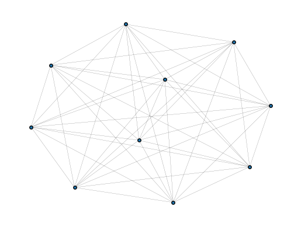

# GradNet

GradNet is a PyTorch-based framework for AI-enabled optimization of networks. Define objectives, static or dynamical, along with structural constraints, and let gradient-based optimization find the optimal network structure.

It encodes the network structure as a differentiable object with optional budget and structure constraints. It lets the users directly optimize static objectives using a lightweight built-in training loop. Alternatively, built-in ODE solvers can be used to define and optimize dynamical objectives.

<p align="center">
  
  <br />
  <em>Illustration of the gradient-based optimization pipeline for network structure.</em>
</p>

<p align="center">
  
  <br />
  <em>A random network rewires itself with GradNet to optimize synchronization in the Kuramoto model.</em>
</p>

## Highlights

- Learn dense or sparse adjacency updates with norm, sign, and symmetry constraints.
- Projected parameterizations that stay differentiable and GPU friendly.
- Torchdiffeq-backed integration utilities for graph-driven dynamical systems.
- Built-in trainer (`gradnet.fit`) that wraps loss functions in just a few lines, with TensorBoard/CSV logging, checkpointing, and a tqdm progress bar.

## Installation

Install the released package from PyPI:

```bash
pip install gradnet
```

To work off the latest sources instead, clone the repository and install in editable mode:

```bash
pip install -e .
```

GradNet targets Python 3.10+ and requires pip 21.3+ (run `pip install --upgrade pip` if needed). It depends on PyTorch, torchdiffeq, NumPy, TensorBoard, matplotlib, and tqdm (installed automatically by the command above). Optional extras:

- `pip install 'gradnet[examples]'` — adds the dependencies used by the Jupyter examples.

## Documentation

Full API documentation, tutorials, and background material live at [gradnet.readthedocs.io](https://gradnet.readthedocs.io/).

## Quickstart

A minimal setup of gradnet optimization, implemented for maximizing Algebraic connectivity. The loss function has an extra minus since loss is always minimized.

```python
from gradnet import GradNet, fit
from gradnet.utils import plot_graph, laplacian
from torch.linalg import eigvalsh


# define a loss function you want to minimize
def negative_algebraic_connectivity(gn):
    # get the adjacency
    A = gn()
    L = laplacian(A)
    eigs = eigvalsh(L)
    return -eigs[1]


gn = GradNet(num_nodes=10, budget=10)
fit(gn=gn,
    loss_fn=negative_algebraic_connectivity,
    num_updates=1000,
    device="cpu")

plot_graph(gn, plt_show=True)
```

Here `num_updates` is the number of optimization steps.
You can set `device="cuda"` to run the optimization on the GPU.

<p align="left">
  
</p>

The examples folder contains Jupyter notebooks demonstrating various features of `gradnet`.

### [Spectral optimization (algebraic connectivity)](examples/1_algebraic_connectivity.ipynb)

Demonstrates a simple example of configuring a `GradNet` object restricted to a grid lattice.
It defines a simple static loss function (the algebraic connectivity).
Then it uses `fit` to optimize the network structure, all in the first code cell of the notebook.
The rest of the notebook is analysis of the optimal grid and comparison of dense and sparse backends.

### [Kuramoto network optimization](examples/2_kuramoto.ipynb)

A simple example of dynamical loss and usage of `integrate_ode`.
Demonstrates structural optimization and emergent sparsity with no mask.

### [Zachary's karate club](examples/3_karate_club.ipynb)

An example showing how to optimally modify existing networks.

## Modules at a glance

- `gradnet.GradNet`: wraps dense and sparse parameterizations, supports directed/undirected networks, masking, custom edge-building costs and more.
- `gradnet.integrate_ode`: torchdiffeq-powered solver with adjoint and event support for adjacency-dependent dynamics.
- `gradnet.fit`: built-in trainer — a self-contained training loop with TensorBoard/CSV logging, best/periodic checkpointing, a tqdm progress bar, and a loss dtype/device safety net.
- `gradnet.utils`: helper functions.

## Credits

GradNet relies on (and is inspired by) the following open-source projects:

- [PyTorch](https://pytorch.org/)
- [torchdiffeq](https://github.com/rtqichen/torchdiffeq)

## License

GradNet is released under the BSD 3-Clause License. See `LICENSE` for details.
