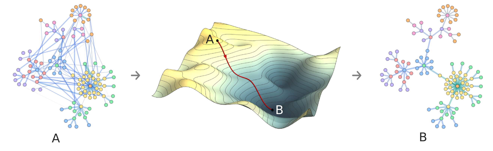

.. gradnet documentation master file, created by
   sphinx-quickstart on Wed Sep 10 00:18:24 2025.
   You can adapt this file completely to your liking, but it should at least
   contain the root `toctree` directive.

GradNet documentation
=====================

GradNet: A PyTorch-based framework for AI-enabled network structure optimization. 
Define arbitrary dynamical objectives and resource constraints, then let autodiff 
discover the architecture, from Kuramoto synchronization to quantum entanglement 
routing, at scales exceeding 10⁶ nodes.

   Illustration of the gradient-based optimization pipeline for network structure.

.. figure:: _static/rewiring_net.gif
   :alt: A random network rewires itself with GradNet to optimize synchronization in the Kuramoto model.
   :align: center
   :class: home-hero
   :width: 400px

   A random network rewires itself with GradNet to optimize synchronization in the Kuramoto model.

Installation
------------

.. code-block:: bash

   pip install gradnet

Quick links
-----------

- :doc:`GradNet </api/gradnet>` – differentiable adjacency matrix model.
- :doc:`fit </api/fit>` – wrap your loss in a single-call trainer built on
  PyTorch Lightning.
- :doc:`integrate_ode </api/integrate_ode>` – integrate GradNet-defined ODEs
  into control or simulation workflows.

Project links
-------------

- `GitHub repository <https://github.com/mikaberidze/gradnet>`_

.. toctree::
   :maxdepth: 1
   :caption: API Reference:
   :titlesonly:

   GradNet (class) <api/gradnet>
   fit (function) <api/fit>
   integrate_ode (function) <api/integrate_ode>
   trainer (module) <api/trainer>
   utils (module) <api/utils>

.. _tutorials-nav:

.. toctree::
   :maxdepth: 1
   :glob:
   :caption: Tutorials:
   :titlesonly:

   tutorials/*
